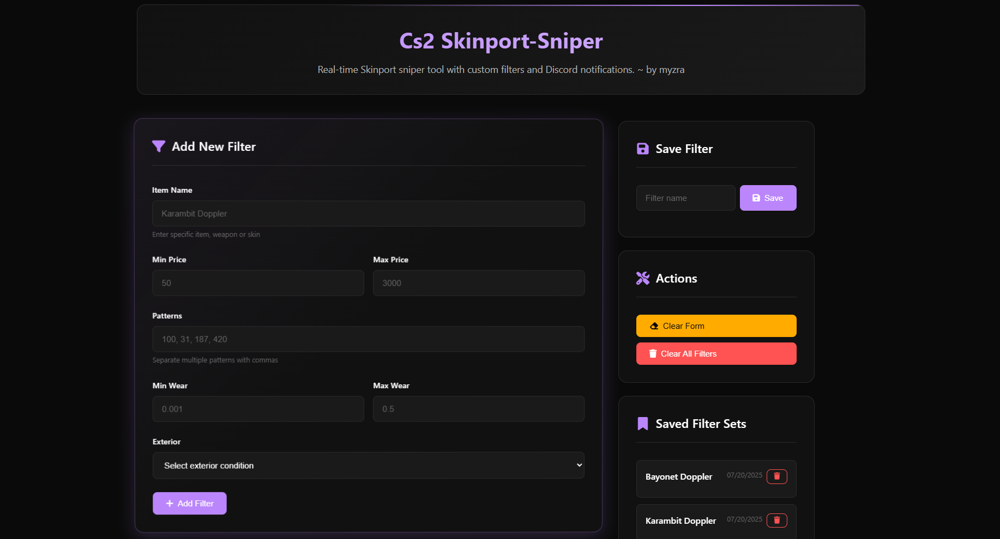
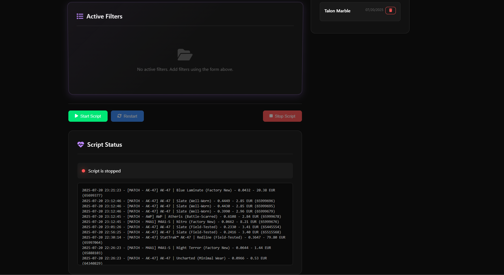

```txt
   _____ __   _                        __     _____       _                    __                                             
  / ___// /__(_)___  ____  ____  _____/ /_   / ___/____  (_)___  ___  _____   / /_  __  __   ____ ___  __  ______  _________ _
  \__ \/ //_/ / __ \/ __ \/ __ \/ ___/ __/   \__ \/ __ \/ / __ \/ _ \/ ___/  / __ \/ / / /  / __ `__ \/ / / /_  / / ___/ __ `/
 ___/ / ,< / / / / / /_/ / /_/ / /  / /_    ___/ / / / / / /_/ /  __/ /     / /_/ / /_/ /  / / / / / / /_/ / / /_/ /  / /_/ / 
/____/_/|_/_/_/ /_/ .___/\____/_/   \__/   /____/_/ /_/_/ .___/\___/_/     /_.___/\__, /  /_/ /_/ /_/\__, / /___/_/   \__,_/  
                 /_/                                   /_/                       /____/             /____/                    
```
[](https://www.python.org/)
[](LICENSE)
# 🔍 What the project does:
It listens to Skinport's WebSocket stream in real time and filters items based on user-defined criteria. When a matching item is found, a notification is sent via Discord. A dashboard built with FastAPI provides a web interface to configure filters and view live marketplace offer logs.

## ✨ Features
- 🌐 Web interface using FastAPI
- ⚡ Live monitoring via WebSocket
- 🧾 JSON-based filter configuration
- 🤖 Discord bot notifications
- 🕵️ Real-time item tracking
- 💾 Filter management with persistent storage

## 📸 Screenshots
<div style="display: flex; gap: 10px;">
  
  
</div>

# 🚀 How to use it:
## 🛠 Requirements
> [!NOTE]
> Make sure the following are installed on your system:

- 🐍 Python 3.12.9
- 🔧 Git
- 📦 pip
- 📜 Poetry
- 📁 Node.js (mit npm)

### __📥 Clone the project__
```
git clone git@github.com:myzra/skinport_sniper.git  
cd skinport_sniper
```
### __📦 Install dependencies__
> [!NOTE]
> 💡 If Poetry is not already installed, you can install it using:
`curl -sSL https://install.python-poetry.org | python3 -`
After installation, make sure `~/.local/bin` is in your `PATH`.

__Install Python dependencies__
```
poetry install
```
__Switch to core folder__
```
cd core
```
__Install Node.js dependecies__
```
npm install
```
### __▶️ Start the project__
```
cd ..
poetry run python .\fastapi\run.py
```
### 🌐 Open in your browser
`http://localhost:8000`

# ⚙️ Environment Variables Setup
> [!IMPORTANT]
> ⚠️ Without setting these environment variables, the bot __will not work__.

## 🔑 Required Variables
| Variable              | Description                                  |
|-----------------------|----------------------------------------------|
| `DISCORD_BOT_TOKEN`   | 🔑 Your Discord bot authentication token    |
| `DISCORD_CHANNEL_ID`  | 📢 ID of the Discord channel where notifications will be sent|
| `API_URL`             | 🌐 URL of the running API service (`http://localhost:3000/skinport-live`)|

## 📁 How to create your `.env` file
__Create a `.env` file on the same folder `discord_bot.py` (skinport_sniper/bot/.env)__
> [!TIP]
> 🐧 **Linux/macOS**:
```
touch bot/.env
```
> [!TIP]
> 🪟 **Windows PowerShell**:
```
New-Item -Path bot\.env -ItemType File
```
> [!TIP]
> 🪟 **Windows CMD**:
```
type nul > bot\.env
```
_Or just create it manually in the `bot` folder, right-click → New → Text Document_
_Rename the file to `.env` (make sure the file extension is not `.txt`)_
## Add the environment variables in this format
```
DISCORD_BOT_TOKEN=your_discord_bot_token_here
DISCORD_CHANNEL_ID=your_discord_channel_id_here
API_URL=http://localhost:3000/skinport-live
```
__Example__
```
DISCORD_BOT_TOKEN=FEGuogbwg2ogg320ewcew0392hf
DISCORD_CHANNEL_ID=13580235321
API_URL=http://localhost:3000/skinport-live
```
> [!NOTE]
> ✅ The scripts `data_parser.py` and `discord_bot.py` will automatically load the `.env` file using the `dotenv` package with the `load_dotenv()` function.

## Project Structure
### 📂 Project Structure

| 📁 Path               | 📝 Description                               |
|-----------------------|----------------------------------------------|
| `/bot/`               | Contains all Discord bot-related files       |
| `├── .env`            | Stores environment variables required for the bot to function|
| `├── discord_bot.py`  | Handles Discord bot initialization and notification logic|
| `/core/`              | Core logic of the application                |
| `├── api_client.js`   | Establishes WebSocket connection and basic offer pre-filtering|
| `├── data_parser.py`  | Receives socket data and applies detailed filter logic|
| `├── filter_engine.py`| Contains logic to filter sales offers based on user settings|
| `├── listing_logger.py`| Logs the last 20 relevant offers for quick access|
| `├── package-lock.json`| Automatically generated lock file for npm dependencies|
| `├── package.json`    | Declares JavaScript dependencies and scripts |
| `/fastapi/`           | FastAPI backend that powers the dashboard    |
| `├── /app/`           | Contains the main FastAPI app structure      |
| `│   └── /routers/`   | API endpoint routing logic                   |
| `│      └── index.py` | Main router file handling RESTful API calls  |
| `│      └── models.py`| Data models for filters and configurations   |
| `│   └── /templates/` | 	Jinja2 template files used for HTML rendering|
| `│      └── base.html`| Base HTML layout template                    |
| `│      └── index.html`| 	Main HTML file for the web interface       |
| `│   └── main.py`     | FastAPI application entry point              |
| `│   └── saved_filters.json`| Stores user-defined filter presets     |
| `│   └── script_params.json`| Stores currently active filter parameters|
| `├── run.py`          | Starts the FastAPI server                    |
| `/logs/`              | Stores runtime log files                     |
| `├── listings.txt`    | Contains the last 20 tracked offers          |
| `/static/`            | Static files for the frontend (CSS, JS)      |
| `│   └── /css/`       | CSS stylesheets directory                    |
| `│      └── styles.css`| Main stylesheet for the frontend            |
| `│   └── /js/`        | JavaScript files for frontend interaction    |
| `│      └── scripts.js`| JS functions used in the dashboard          |
| `/tests/`              | Folder for test files                       |
| `├── test_filter_engine.py`| Tests filter behavior with different parameters|
| `poetry.lock`         | Locks the exact versions of Python dependencies|
| `pyproject.toml`      | Declares Python dependencies and project config for Poetry|
| `.gitignore`          | Specifies files and folders to be ignored by Git|
| `LICENSE`            | Contains the project license (e.g., MIT, GPL) |
| `README.md`           | Documentation and usage guide                |

## 👨‍💻 Author

Created by [myzra](https://github.com/myzra) \
[Licensed under the MIT License](LICENSE)

